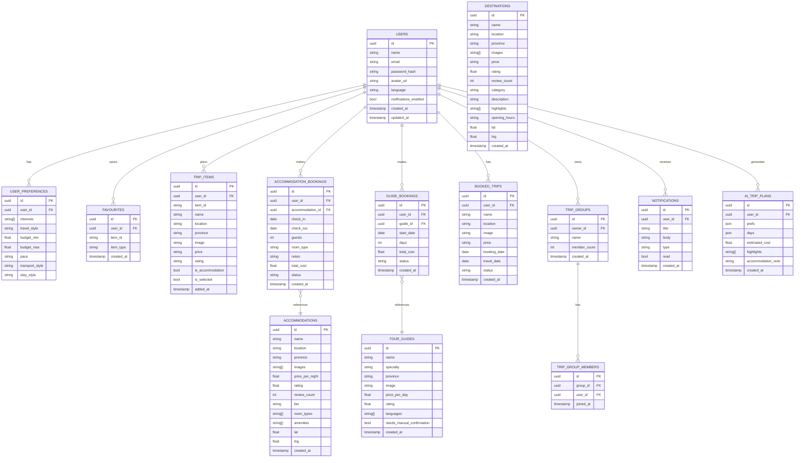

# Backend — Data Models & Database Schema

Derived from the mobile domain entities in `trip_entities.dart` and `trip_builder_model.dart`.

---

## Entity Relationship Diagram



---

## Table Descriptions

### `users`
Core user account. Password is hashed (bcrypt). OAuth users have `password_hash = null`.

### `user_preferences`
One-to-one with users. Stores trip planning preferences that drive the plan options engine.

| Field | Maps to mobile |
|---|---|
| `interests` | `TripPlanningProfile.interests` |
| `travel_style` | `TripPlanningProfile.pace` |
| `transport_style` | `TripPlanningProfile.transportStyle` |
| `stay_style` | `TripPlanningProfile.stayStyle` |

### `destinations`
All tourist destinations across Rwanda's provinces.  
`category` values: `nature`, `wildlife`, `volcano`, `culture`, `adventure`.

### `accommodations`
Hotels, lodges, eco-lodges.  
`tier` values: `budget`, `mid`, `luxury`.

### `tour_guides`
Licensed guides per province.  
`needs_manual_confirmation = true` means the booking goes to `awaitingConfirmation` state on mobile.

### `favourites`
Polymorphic — `item_type` is `destination` or `accommodation`.

### `trip_items`
The user's trip planner list. `is_selected` tracks which items are in the active planning session.

### `accommodation_bookings`
`status` values: `pending`, `confirmed`, `completed`, `cancelled`.

### `guide_bookings`
`status` values: `pending`, `confirmed`.  
When a guide has `needs_manual_confirmation`, an admin must PATCH the status to `confirmed`.

### `booked_trips`
Final confirmed trips. Created when the user completes checkout.  
`status` values: `pending`, `confirmed`, `completed`.

### `ai_trip_plans`
Stores AI-generated plans as JSON blobs for history and re-use.

### `notifications`
`type` values: `booking_confirmed`, `trip_ready`, `guide_confirmed`, `promo`, `system`.

---

## Indexes (recommended)

```sql
-- Fast user lookups
CREATE INDEX idx_users_email ON users(email);

-- Destination filtering
CREATE INDEX idx_destinations_province ON destinations(province);
CREATE INDEX idx_destinations_category ON destinations(category);

-- Accommodation filtering
CREATE INDEX idx_accommodations_province ON accommodations(province);
CREATE INDEX idx_accommodations_tier ON accommodations(tier);

-- User-scoped queries
CREATE INDEX idx_favourites_user ON favourites(user_id);
CREATE INDEX idx_trip_items_user ON trip_items(user_id);
CREATE INDEX idx_bookings_user ON accommodation_bookings(user_id);
CREATE INDEX idx_guide_bookings_user ON guide_bookings(user_id);
CREATE INDEX idx_notifications_user_unread ON notifications(user_id, read);
```
