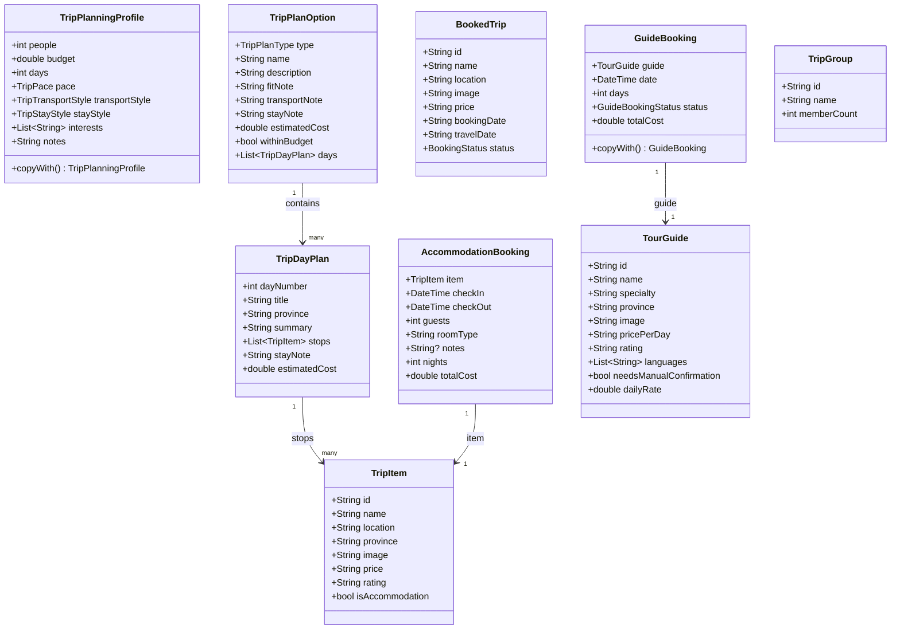
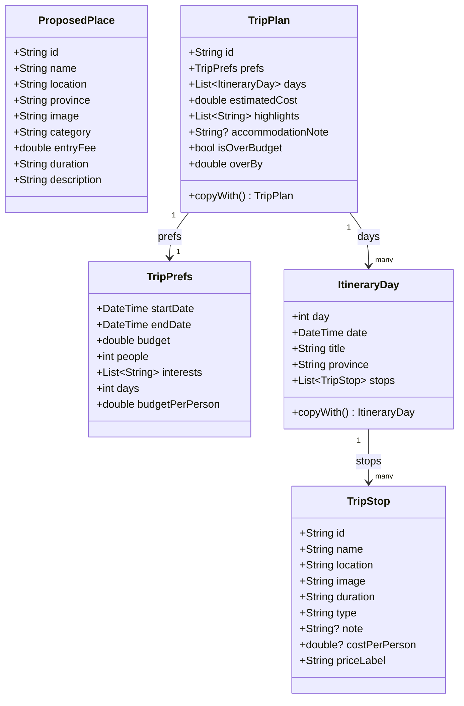
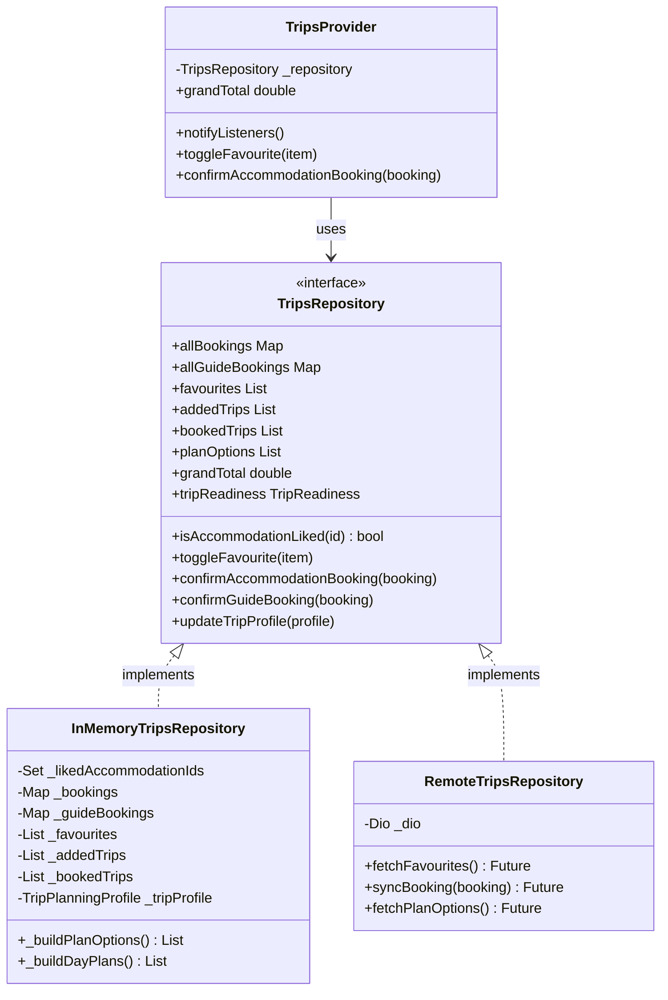
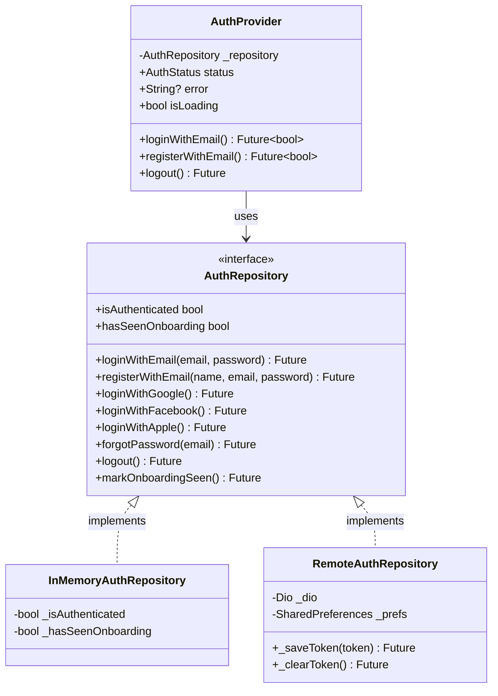
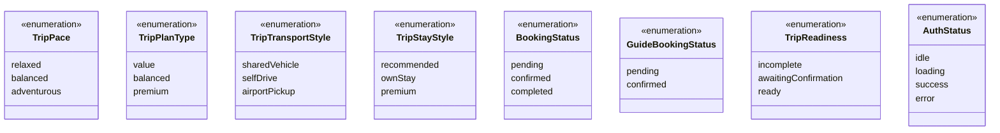
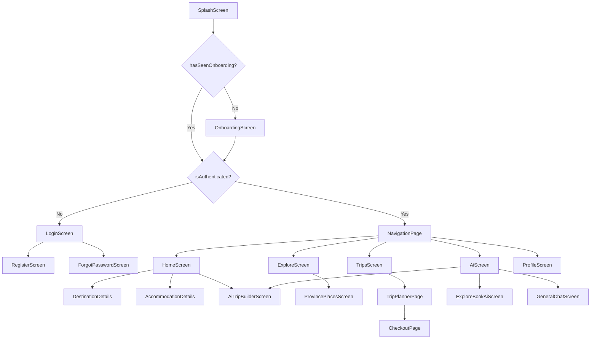

# Mobile — Class & Domain Diagrams

All diagrams use [Mermaid](https://mermaid.js.org/) syntax.  
Render in GitHub, VS Code (Mermaid extension), or https://mermaid.live

---

## 1. Core Domain Entity Diagram

---

## 2. AI Trip Builder Domain

---

## 3. Repository Pattern

---

## 4. Auth Flow

---

## 5. Enumerations

---

## 6. Navigation & Screen Hierarchy

